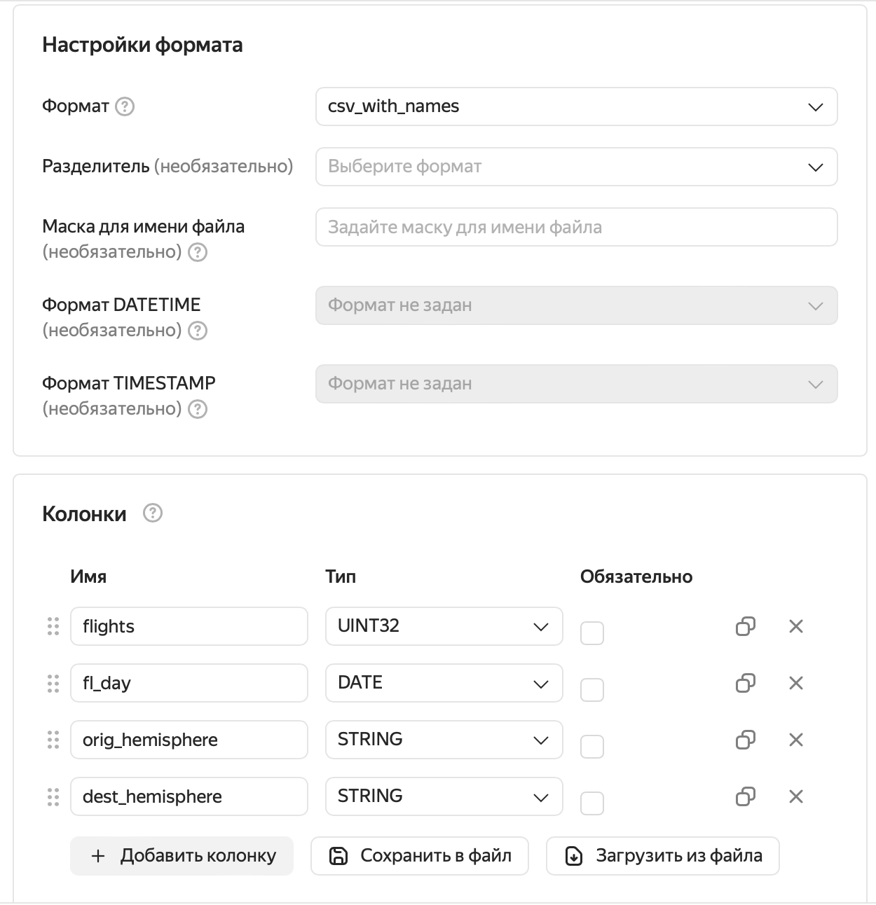

# Построение витрины с использованием Yandex Query

Цель решения - продемонстрировать возможности Yandex Query как самостоятельного инструмента для работы с большими данными

Содержание

- подготовка инфраструктуры
- загрузка данных в Object Storage
- создание соединения и привязки Yandex Query
- обработка данных 
- оптимизация обработки
- формирование выходной витрины  
- DataLens Dashboard над витриной в Yandex Query

Во время работы с решением потребуется утилиты

- yc - [Command line interface helps you interact with Yandex Cloud services](https://yandex.cloud/ru/docs/cli/cli-ref/)
- aws - [Интерфейс командной строки для работы с aws-совместимыми сервисами Yandex Cloud](https://yandex.cloud/ru/docs/storage/tools/aws-cli)


## Набор данных 
В этом решении мы будем использовать публичный набор данных о воздушном движении OpenSky Network 2020:
*** 
"Данные в этом наборе получены и отфильтрованы из полного набора данных OpenSky, чтобы проиллюстрировать развитие воздушного движения во время пандемии COVID-19. Набор включает в себя все рейсы, которые видели более 2500 участников сети с 1 января 2019 года. Дополнительные данные будут периодически включаться в набор данных до окончания пандемии COVID-19".

Источник: https://zenodo.org/record/5092942#.YRBCyTpRXYd

Martin Strohmeier, Xavier Olive, Jannis Lübbe, Matthias Schäfer, and Vincent Lenders "Crowdsourced air traffic data from the OpenSky Network 2019–2020" Earth System Science Data 13(2), 2021 https://doi.org/10.5194/essd-13-357-2021 
***


## Создание инфраструктуры для хранения данных 
 - создадим новый bucket Object Storage
```sh
yc storage bucket create \
  --name  osn-bucket \
  --max-size 10737418240
```

- создадим сервисный аккаунт, под которым Yandex Query будет соединяться с Object Storage
```sh
yc iam service-account create --name sa-osn 
```

-  и назначим сервисному аккаунту роль storage.editor, так как нам придется как читать данные из Object Storage, так и писать их  при создании витрины 
```sh
yc resource-manager folder add-access-binding $(yc config get folder-id) \
  --role storage.editor \
  --service-account-name sa-osn   
```

- создадим статический ключ для доступа aws cli к Object Storage bucket
```sh
yc iam access-key create --service-account-name sa-osn
```

Вывод команды нужно использовать для настройки aws cli по примеру того, как это указано [здесь](https://yandex.cloud/ru/docs/storage/tools/aws-cli#config-files). 
Этот же вывод нужно сохранить - он потребуется нам на финальном этапе решения

## Скачивание и загрузка данных
Для скачивания данных воспользуемся командой 

```sh 
mkdir osn $$ cd osn
wget -O- https://zenodo.org/records/5092942 | grep -oP 'https://zenodo.org/records/5092942/files/flightlist_\d+_\d+\.csv\.gz' | xargs wget
```
Скачивание займет несколько минут. В итоге в текущем каталоге должно появиться 30 файлов общим объемом около 4.5 Гб. Эти данные мы безо всяких изменений поместим в Yandex Object Storage. 
```sh
aws --endpoint-url=https://storage.yandexcloud.net/ s3 cp --recursive ./ s3://osn-bucket/osn/
```


## Работа с данными в Yandex Query
Начать работу с Yandex Query необходимо с ознакомления с [Yandex Query IDE](https://yq.yandex.cloud/) - полнофункциональной интерактивной среды управления сервисом. В ней мы будем создавать соединение и привязку к данным, писать запросы наполнения витрин и анализировать статистику их выполнения. 

### Создание соединения
Основы работы с соединениями можно почерпнуть [отсюда](https://yandex.cloud/ru/docs/query/operations/connection). В нашем случае нужно заполнить соответствующие поля:
 - имя               - osn-connection
 - тип соединения    - Object Storage
 - bucket            - osn-bucket
 - сервисный аккаунт - sa-osn 
 
 значениями, созданными на этапе [Создание инфраструктуры](#создание-инфраструктуры-для-хранения-данных) и нажать на кнопку "Создать" 


# Создание привязки
Привязка описывает путь, формат и схему данных. Детали работы с привязками описаны [здесь](https://yandex.cloud/ru/docs/query/operations/binding). Наш первый вариант мы создадим так


Блок настроек "Колонки партиционирования" оставим здесь нетронутым. 

## Работа с данными
Итак, у нас все готово к тому, чтобы начать работать с нашими данными с помощью [YQL запросов](https://yandex.cloud/ru/docs/query/yql-tutorials/).

Выполним наш первый запрос

```sql
select
   icao24, count(1) cnt
from
   `osn-link`
where day >= DATE('2020-01-01') 
and day <= DATE('2020-01-31')
group by icao24
order by cnt desc; 
```

если все было создано и настроено верно, то мы узнаем, что больше всех в этот период летал борт "a255ee". 

## Оптимизация 
Здесь нужно обратить внимание на статистику исполнения запроса:
 
при выполнении запроса мы прочитали все данные - см. IngressBytes
Это произошло потому, что у сервиса нет никаких знаний о том, что данные у нас фактически разбиты на файлы, в которых информация  хранится по месяцам. Давайте попробуем дать сервису эти знания.

Для этого мы загрузим все в bucket снова, снабдив при этом каждый файл префиксом пути /year/month/
```sh
aws --endpoint-url=https://storage.yandexcloud.net/ s3 rm s3://osn-bucket/osn --recursive
for f in *
 do aws --endpoint-url=https://storage.yandexcloud.net/ s3 cp \
   $f s3://osn-bucket/osn/$(echo $f | sed -r 's/.{11}(.{4}).*/\1/')/$(echo $f | sed -r 's/.{15}(.{2}).*/\1/')/
done
```

отредактируем привязку, заполнив там пропущенный нами на первом этапе блок "Колонки партиционирования"


и Шаблон пути


Выполним снова наш запрос, переписав его исходя из новой структуры хранения 
```sql
select
   icao24, count(1) cnt
from
   `osn-link`
where year = 2020 and month = 1
group by icao24
order by cnt desc; 
```

Теперь запрос вычитывает из Object Storage только один файл 
 


## Формирование выходной витрины 
Выходной витриной у нас будет сумма вылетов по дням с измерениями "полушарие вылета" и "полушарие прилета". 
Для хранения этой информации создадим новую привязку
 
 

После создания привязки пробуем наполнить нашу витрину

```sql
insert into `osn-mart` (flights, fl_day, orig_hemisphere, dest_hemisphere)
select
   cast(count(1) as UInt32) as flights, 
   cast(day as DATE) as fl_day,
   orig_hemisphere,
   dest_hemisphere
from
   `osn-link`
group by day,
  just(IF(longitude_1 > 0, 'EAST', 'WEST')) as orig_hemisphere,
  just(IF(longitude_2 > 0, 'EAST', 'WEST')) as dest_hemisphere;
```

## Datalens Dashboard
Подробно рассматривать процесс создания Datalens Dashboard не входит в цель данного решения. Это детально описано в [документации сервиса](https://yandex.cloud/ru/docs/datalens/). Здесь лишь приведен один из вариантов визуализации данных витрины, созданной в Yandex Query
 


## Автоматизация актуализации витрины
У нас готова витрина и Dashboard. Добавим пару штрихов - функцию и триггер, которые будут актуализировать нашу витрину при добавлении новых данных в источник - наш bucket в Object Storage. Для этого

- склонируем себе текущий репозиторий, если еще этого не сделали
```sh 
git clone https://pol-edu2.gitlab.yandexcloud.net/dp-solutions/yc-yq-osn
```

- добавим дополнительные роли сервисному аккаунту sa-osn для возможности 
  - исполнять запросы Yandex Query
```sh
yc resource-manager folder add-access-binding $(yc config get folder-id) \
  --role yq.invoker \
  --service-account-name sa-osn
```

  - запускать serverless функции
```sh
yc resource-manager folder add-access-binding $(yc config get folder-id) \
  --role functions.functionInvoker \
  --service-account-name sa-osn
```

  - читать секреты
```sh
yc resource-manager folder add-access-binding $(yc config get folder-id) \
  --role lockbox.payloadViewer \
  --service-account-name sa-osn
```

- создадим секрет. Туда сохраним наш статический ключ, полученный на этапе создания инфраструктуры
```sh
yc lockbox secret create \
 --name osn-secret \
 --payload "[{'key': 'accessKey', 'text_value': '<ACCESS KEY>'},{'key': 'secretKey', 'text_value': '<SECRET KEY>'}]"
```
Внимание! Плейсхолдеры <SOME VAL> здесь нужно заменить на фактические значения, сохраненные из вывода команды yc iam access-key create

- создадим саму функцию 
```sh
yc serverless function create --name=osn-mart-renew
```

- создадим архив исходного кода из склонированного каталога /src, который будет исполнять наша функция 
```sh
zip -j osn yc-yq-osn/src/*
```

- создадим конкретную реализацию-версию
```sh
yc serverless function version create \
  --function-name=osn-mart-renew \
  --runtime bash-2204 \
  --service-account-id $(yc iam service-account get --name sa-osn |grep ^id|sed -r 's/.{4}(.*)/\1/') \
  --entrypoint handler.sh \
  --execution-timeout 5s \
  --source-path ./osn.zip \
  --environment YC_FOLDER=$(yc config get folder-id) \
  --secret environment-variable=AWS_ACCESS_KEY_ID,name=osn-secret,key=accessKey \
  --secret environment-variable=AWS_SECRET_ACCESS_KEY,name=osn-secret,key=secretKey
```  

- и триггер, который будет реагировать на добавление новых файлов в Object Storage
```sh
yc serverless trigger create object-storage osn-mart \
  --bucket-id=osn-bucket\
  --prefix=osn/ \
  --events=create-object \
  --invoke-function-service-account-name=sa-osn \
  --invoke-function-name=osn-mart-renew
```

Теперь все готово для автоматической генерации витрины при поступлении новых данных. Проверить работоспособность можно удалив и загрузив обратно любой из файлов начального набора данных. При этом в логах функции должна появиться информация об ее успешном запуске. 