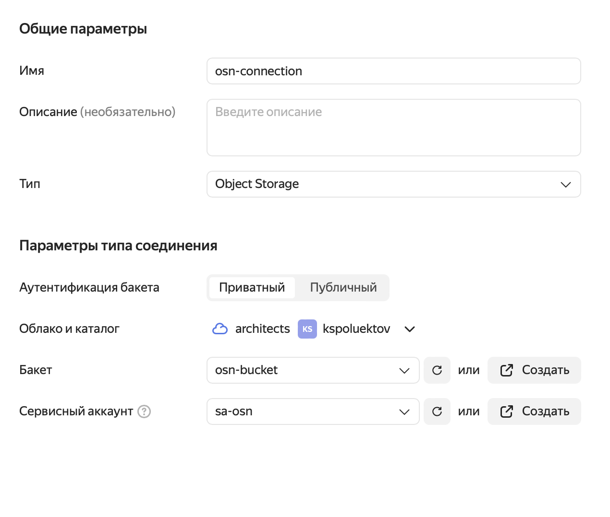
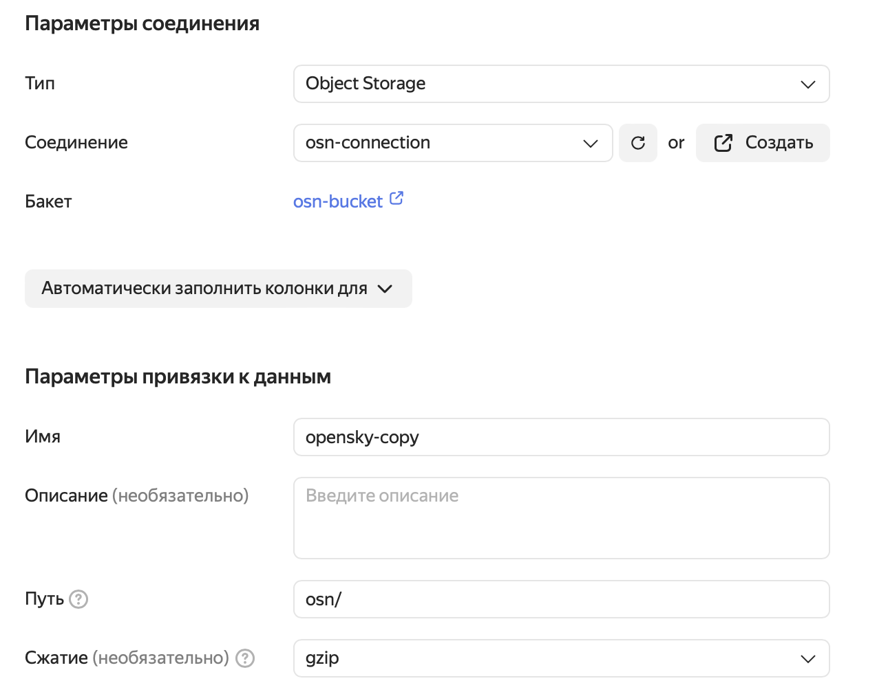
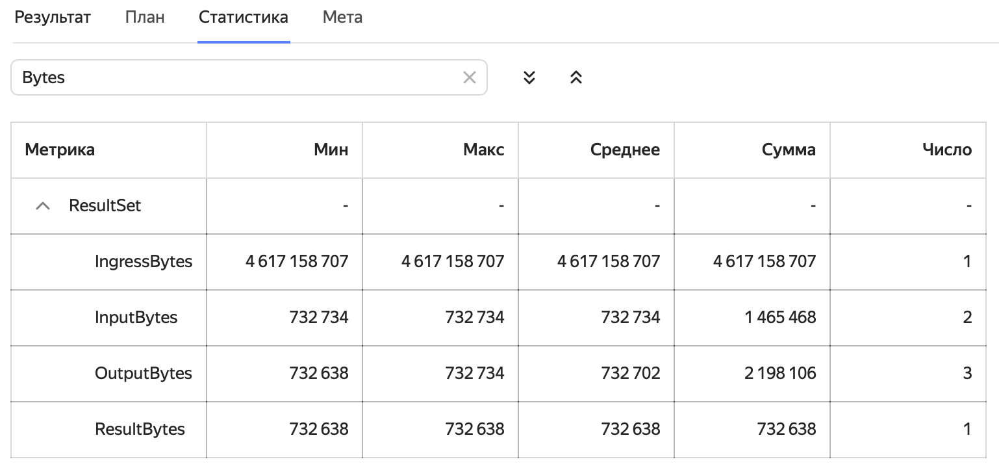
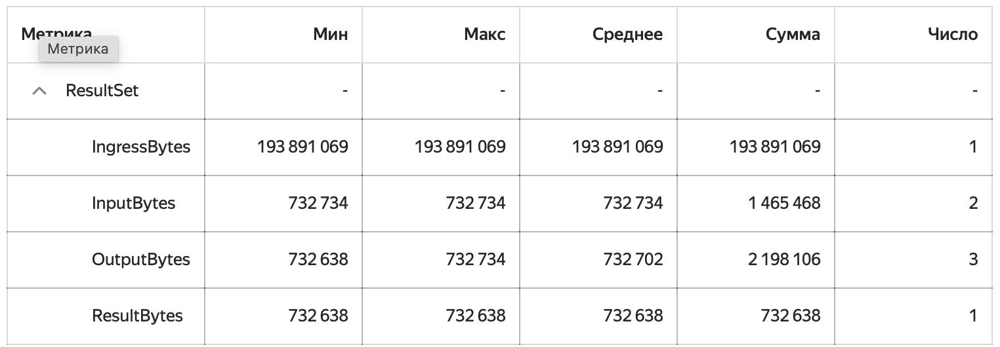
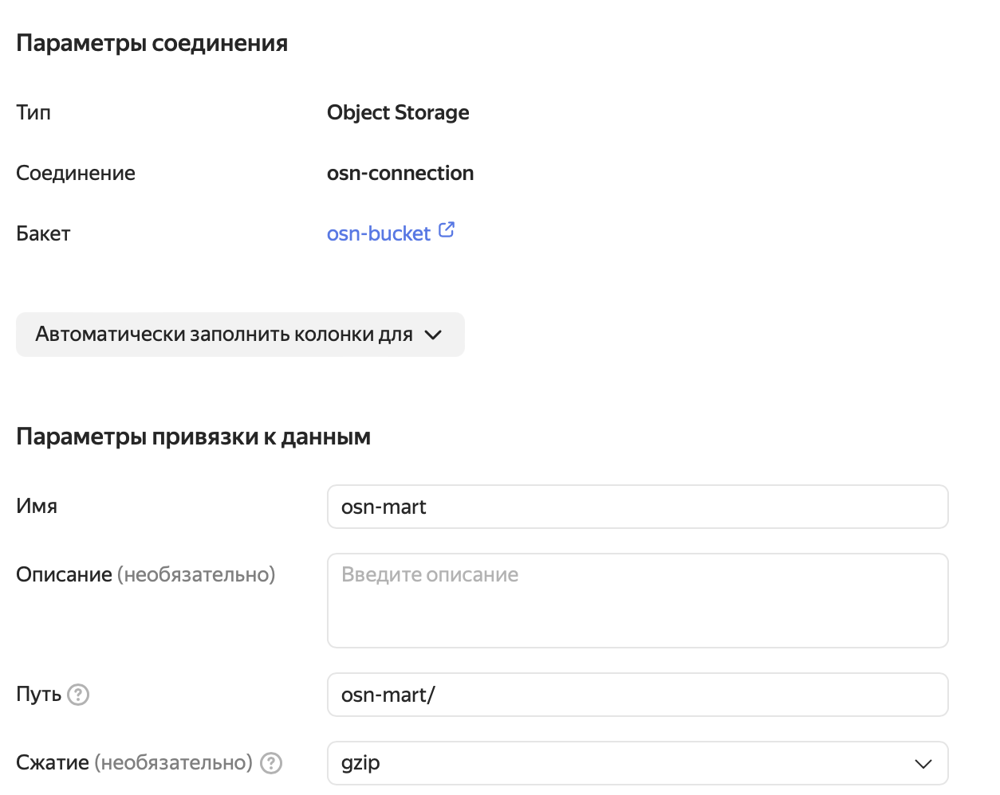
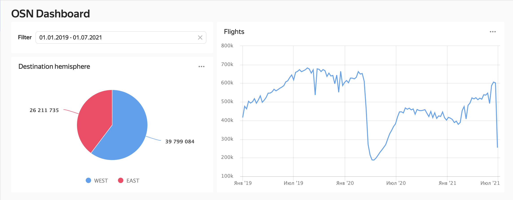

# Employing Yandex Query to make a data mart

This aims to make evident what Yandex Query can do for you as a standalone tool for exploring big data.

Contents

- Setting up the infrastructure
- Uploading data to Object Storage
- Connecting to and binding Yandex Query
- Processing data 
- Streamlining the processing
- Generating an output data mart  
- DataLens Dashboard over a Yandex Query data mart

When implementing this, you will need the following utilities:

- `yc`: [Command line interface that helps you work with Yandex Cloud services](https://yandex.cloud/ru/docs/cli/cli-ref/).
- `aws`: [Command line interface that helps you work with AWS-compatible Yandex Cloud services](https://yandex.cloud/ru/docs/storage/tools/aws-cli).


## Dataset 
Here, we refer to the OpenSky Network 2020 public air traffic dataset:
*** 
"The data in this dataset is derived and cleaned from the full OpenSky dataset to illustrate the development of air traffic during the COVID-19 pandemic. It spans all flights seen by the network's more than 2500 members since January 1, 2019. More data will be periodically included in the dataset until the end of the COVID-19 pandemic."

Source: https://zenodo.org/record/5092942#.YRBCyTpRXYd

Martin Strohmeier, Xavier Olive, Jannis Lübbe, Matthias Schäfer, and Vincent Lenders. Crowdsourced air traffic data from the OpenSky Network 2019–2020. Earth System Science Data 13(2), 2021. https://doi.org/10.5194/essd-13-357-2021 
***


## Creating infrastructure to store the data 
 - Let’s create a new Object Storage bucket:
```sh
yc storage bucket create \
  --name  osn-bucket \
  --max-size 10737418240
```

- Then, we create a service account under which Yandex Query will connect to Object Storage:
```sh
yc iam service-account create --name sa-osn 
```

-  Now we assign the `storage.editor` role to the service account, since we will have to both read data from Object Storage and write it when creating our data mart: 
```sh
yc resource-manager folder add-access-binding $(yc config get folder-id) \
  --role storage.editor \
  --service-account-name sa-osn   
```

- Now we create a static key for AWS CLI access to our Object Storage bucket:
```sh
yc iam access-key create --service-account-name sa-osn
```

Given the command output, configure your AWS CLI as showed [here](https://yandex.cloud/ru/docs/storage/tools/aws-cli#config-files). 
Keep the output data, as we will need it for the final step.

## Downloading the dataset and uploading data
This is how we download the dataset: 

```sh 
mkdir osn $$ cd osn
wget -O- https://zenodo.org/records/5092942 | grep -oP 'https://zenodo.org/records/5092942/files/flightlist_\d+_\d+\.csv\.gz' | xargs wget
```
The download will take a few minutes; once complete, 30 files totaling about 4.5 GB should appear in your current folder. Now we forward this data, as is, to Yandex Object Storage. 
```sh
aws --endpoint-url=https://storage.yandexcloud.net/ s3 cp --recursive ./ s3://osn-bucket/osn/
```


## Working with data in Yandex Query
To start working with Yandex Query, you first need to check out its full-featured interactive management studio that is called [Yandex Query IDE](https://yq.yandex.cloud/). In this environment, we will create a connection and data binding, write queries to populate our data marts, and analyze their execution statistics. 

### Creating a connection
See [this](https://yandex.cloud/ru/docs/query/operations/connection) to learn the basics of how to manage connections. We need to fill in the appropriate fields:
 - name              - osn-connection
 - connection type   - Object Storage
 - bucket            - osn-bucket
 - service account   - sa-osn 
 
 with the values we got when [Creating infrastructure](#создание-инфраструктуры-для-хранения-данных), and click **Create**. 



# Creating a binding
A binding describes the path, format, and schema for your data. For details on binding, see [this](https://yandex.cloud/ru/docs/query/operations/binding). This is how we create our first case:




Here, we leave the entire **Partitioning columns** section as is. 

## Operations with data
Now, we are all set to start exploring our data with [YQL queries](https://yandex.cloud/ru/docs/query/yql-tutorials/).

Let’s run our first query:

```sql
select
   icao24, count(1) cnt
from
   `osn-link`
where day >= DATE('2020-01-01') 
and day <= DATE('2020-01-31')
group by icao24
order by cnt desc; 
```

If everything is created and configured correctly, we will find out that the `a255ee` board was the one that flew the most during this period. 

## Streamlining 
The query execution statistics is what you want to pay attention to:
 
When running the query we read all data (see `IngressBytes`).
This happened because Yandex Query is not aware that we actually have our data broken down into files where information is stored by month. Let’s try to fill this knowledge gap.

To do this, we upload everything to our bucket again, now prefixing each file with the `/year/month/` path prefix:
```sh
aws --endpoint-url=https://storage.yandexcloud.net/ s3 rm s3://osn-bucket/osn --recursive
for f in *
 do aws --endpoint-url=https://storage.yandexcloud.net/ s3 cp \
   $f s3://osn-bucket/osn/$(echo $f | sed -r 's/.{11}(.{4}).*/\1/')/$(echo $f | sed -r 's/.{15}(.{2}).*/\1/')/
done
```

We edit the binding by filling in the **Partitioning columns** section that we skipped earlier:


We also fill in the path template:


Let’s run our query once again, rewriting it based on the new storage structure: 
```sql
select
   icao24, count(1) cnt
from
   `osn-link`
where year = 2020 and month = 1
group by icao24
order by cnt desc; 
```

Now our query reads only one Object Storage file: 
 


## Generating an output data mart 
Our output data mart will count flights by day, with the `orig_hemisphere` and `dest_hemisphere` dimensions. 
To store this information, we create a new binding:
 
 

After creating this, let’s try to populate our data mart once again:

```sql
insert into `osn-mart` (flights, fl_day, orig_hemisphere, dest_hemisphere)
select
   cast(count(1) as UInt32) as flights, 
   cast(day as DATE) as fl_day,
   orig_hemisphere,
   dest_hemisphere
from
   `osn-link`
group by day,
  just(IF(longitude_1 > 0, 'EAST', 'WEST')) as orig_hemisphere,
  just(IF(longitude_2 > 0, 'EAST', 'WEST')) as dest_hemisphere;
```

## Datalens Dashboard
We will not focus on creating any DataLens dashboards here; for details on this, see the relevant [documentation](https://yandex.cloud/ru/docs/datalens/). Here, we simply aim to represent a visualization case for a data mart created in Yandex Query:
 


## Automating the data mart refresh
We now have a ready data mart and our dashboard. Let’s add a couple of touches: a function and a trigger to refresh our data mart when new data is added to the source (our Object Storage bucket). To do this:

- Clone the current repository (if not cloned yet):
```sh 
git clone https://github.com/yandex-cloud-examples/yc-yq-datamart-osn.git
```

- Add more roles to the `sa-osn` service account to: 
  - Run Yandex Query queries:
```sh
yc resource-manager folder add-access-binding $(yc config get folder-id) \
  --role yq.invoker \
  --service-account-name sa-osn
```

  - Run serverless functions:
```sh
yc resource-manager folder add-access-binding $(yc config get folder-id) \
  --role functions.functionInvoker \
  --service-account-name sa-osn
```

  - Read secrets:
```sh
yc resource-manager folder add-access-binding $(yc config get folder-id) \
  --role lockbox.payloadViewer \
  --service-account-name sa-osn
```

- Let’s create a secret to keep the static key we got when creating the infrastructure:
```sh
yc lockbox secret create \
 --name osn-secret \
 --payload "[{'key': 'accessKey', 'text_value': '<ACCESS KEY>'},{'key': 'secretKey', 'text_value': '<SECRET KEY>'}]"
```
Note: Make sure to replace all <SOME VAL> placeholders with actual values from the `yc iam access-key create` output.

- Now we create the function: 
```sh
yc serverless function create --name=osn-mart-renew
```

- We create the source code zip archive from the cloned folder, `/src`. This code is what our function will do: 
```sh
zip -j osn yc-yq-osn/src/*
```

- Now we create a specific version:
```sh
yc serverless function version create \
  --function-name=osn-mart-renew \
  --runtime bash-2204 \
  --service-account-id $(yc iam service-account get --name sa-osn |grep ^id|sed -r 's/.{4}(.*)/\1/') \
  --entrypoint handler.sh \
  --execution-timeout 5s \
  --source-path ./osn.zip \
  --environment YC_FOLDER=$(yc config get folder-id) \
  --secret environment-variable=AWS_ACCESS_KEY_ID,name=osn-secret,key=accessKey \
  --secret environment-variable=AWS_SECRET_ACCESS_KEY,name=osn-secret,key=secretKey
```  

- We also create a trigger that will fire when new files are added to Object Storage:
```sh
yc serverless trigger create object-storage osn-mart \
  --bucket-id=osn-bucket\
  --prefix=osn/ \
  --events=create-object \
  --invoke-function-service-account-name=sa-osn \
  --invoke-function-name=osn-mart-renew
```

Finally, everything is all set for automatic data mart generation as new data arrives. You can check this by deleting and uploading back any of the initial dataset files. In this case, the function logs should show that it was successfully run. 